# HRIS Database Entities Documentation

This document provides comprehensive documentation for all database entities in the HRIS (Human Resource Information System) application, including their structure, relationships, and business logic.

## Table of Contents

1. [Overview](#overview)
2. [Core Entity - Employee](#core-entity---employee)
3. [Address Entities](#address-entities)
4. [Employment Entities](#employment-entities)
5. [Personal Information Entities](#personal-information-entities)
6. [Education Entities](#education-entities)
7. [Training Entities](#training-entities)
8. [Work Experience Entities](#work-experience-entities)
9. [Reference Entity](#reference-entity)
10. [Entity Relationships Diagram](#entity-relationships-diagram)
11. [Database Constraints](#database-constraints)

## Overview

The HRIS database is designed using a normalized structure with the `Employee` entity as the central hub. The system follows a clean architecture pattern with clear separation between domain models, repositories, and infrastructure layers.

### Key Design Principles

- **Normalization**: Lookup tables for reference data (religion, civil status, etc.)
- **Referential Integrity**: Foreign key relationships ensure data consistency
- **Soft Deletes**: `isActive` boolean flags instead of hard deletes
- **Audit Trail**: Timestamps and user tracking capabilities
- **Flexibility**: Optional fields for incomplete data
- **PostgreSQL Optimization**: Optimized for PostgreSQL with proper data types and indexes
- **Performance**: Strategic indexes for common queries
- **Data Integrity**: Database-level constraints and validation

## Core Entity - Employee

### EmployeeEntity

The central entity that stores comprehensive employee information including personal, employment, address, and financial data.

**Table Name**: `employee`

**Key Fields**:

- `id`: Primary key (auto-generated)
- `fname`, `lname`, `mname`, `suffix`: Name components (100 chars)
- `idnumber`, `bioNumber`: Unique identifiers (100 chars)
- `birthDate`, `hireDate`, `endDate`: Important dates
- `annualSalary`, `monthlySalary`, `dailyRate`, `hourlyRate`: Compensation (decimal 10,2)
- `sssNo`, `tinNo`, `phic`, `hdmf`: Government IDs (255 chars)
- `email`: Email address (255 chars)
- `homeAddressStreet`, `presentAddressStreet`: Address fields (500 chars)
- `createdAt`, `updatedAt`: Audit timestamps
- `createdBy`, `updatedBy`: Audit user tracking

**Relationships**:

- **Many-to-One** with all lookup entities (Branch, Department, JobTitle, etc.)
- **One-to-Many** with Education, Training, Work Experience, and References

**Indexes**:

- Composite index on `fname`, `mname`, `lname`, `idnumber`
- Individual indexes on `idnumber`, `bioNumber`, `email`

## Address Entities

### ProvinceEntity

Stores Philippine provinces for address management.

**Table Name**: `province`

**Fields**:

- `id`: Primary key
- `desc1`: Province name (unique)
- `isActive`: Status flag

**Relationships**:

- **One-to-Many** with Employee (home and present addresses)

### CityEntity

Stores cities/municipalities for address management.

**Table Name**: `city`

**Fields**:

- `id`: Primary key
- `desc1`: City name (unique)
- `isActive`: Status flag

**Relationships**:

- **One-to-Many** with Employee (home and present addresses)

### BarangayEntity

Stores barangays (smallest administrative division) for detailed address management.

**Table Name**: `barangay`

**Fields**:

- `id`: Primary key
- `desc1`: Barangay name (unique)
- `isActive`: Status flag

**Relationships**:

- **One-to-Many** with Employee (home and present addresses)

## Employment Entities

### BranchEntity

Represents company branches or locations.

**Table Name**: `branch`

**Fields**:

- `id`: Primary key
- `desc1`: Branch name
- `brCode`: Branch code (5 characters)
- Unique constraint on `brCode` and `desc1`

**Relationships**:

- **One-to-Many** with Employee

### DepartmentEntity

Represents organizational departments.

**Table Name**: `department`

**Fields**:

- `id`: Primary key
- `desc1`: Department name (unique)
- `code`: Department code (10 characters, optional)
- `designation`: Department designation (optional)
- `isActive`: Status flag

**Relationships**:

- **One-to-Many** with Employee

### JobTitleEntity

Represents job positions within the organization.

**Table Name**: `job_title`

**Fields**:

- `id`: Primary key
- `desc1`: Job title (unique)
- `isActive`: Status flag

**Relationships**:

- **One-to-Many** with Employee

### EmpStatusEntity

Represents employment status (active, inactive, terminated, etc.).

**Table Name**: `emp_status`

**Fields**:

- `id`: Primary key
- `desc1`: Status description (unique)
- `isActive`: Status flag

**Relationships**:

- **One-to-Many** with Employee

## Personal Information Entities

### ReligionEntity

Stores religious affiliations.

**Table Name**: `religion`

**Fields**:

- `id`: Primary key
- `desc1`: Religion name (unique)
- `isActive`: Status flag

**Relationships**:

- **One-to-Many** with Employee

### CivilStatusEntity

Stores civil status options (single, married, widowed, etc.).

**Table Name**: `civil_status`

**Fields**:

- `id`: Primary key
- `desc1`: Civil status (unique)
- `isActive`: Status flag

**Relationships**:

- **One-to-Many** with Employee

### CitizenShipEntity

Stores citizenship information.

**Table Name**: `citizenship`

**Fields**:

- `id`: Primary key
- `desc1`: Citizenship (unique)
- `isActive`: Status flag

**Relationships**:

- **One-to-Many** with Employee

## Education Entities

### EducationLevelEntity

Represents education levels (elementary, high school, college, etc.).

**Table Name**: `edu_level`

**Fields**:

- `id`: Primary key
- `desc1`: Education level (unique)
- `isActive`: Status flag

**Relationships**:

- **One-to-Many** with EduEntity

### SchoolEntity

Stores educational institutions.

**Table Name**: `edu_school`

**Fields**:

- `id`: Primary key
- `desc1`: School name (unique)
- `isActive`: Status flag

**Relationships**:

- **One-to-Many** with EduEntity

### CourseEntity

Stores academic courses/programs.

**Table Name**: `edu_course`

**Fields**:

- `id`: Primary key
- `desc1`: Course name (unique)
- `isActive`: Status flag

**Relationships**:

- **One-to-Many** with EduEntity

### CourseLevelEntity

Stores course levels (bachelor's, master's, doctorate, etc.).

**Table Name**: `edu_courselevel`

**Fields**:

- `id`: Primary key
- `desc1`: Course level (unique)
- `isActive`: Status flag

**Relationships**:

- **One-to-Many** with EduEntity

### EduEntity

Main education record linking employees to their educational background.

**Table Name**: `edu`

**Fields**:

- `id`: Primary key
- `schoolYear`: Academic year
- `eduSchoolId`: Foreign key to SchoolEntity
- `eduLevelId`: Foreign key to EducationLevelEntity
- `eduCourseId`: Foreign key to CourseEntity (optional)
- `eduCourseLevelId`: Foreign key to CourseLevelEntity (optional)
- `employeeId`: Foreign key to EmployeeEntity
- `isActive`: Status flag

**Relationships**:

- **Many-to-One** with EmployeeEntity
- **Many-to-One** with SchoolEntity
- **Many-to-One** with EducationLevelEntity
- **Many-to-One** with CourseEntity (optional)
- **Many-to-One** with CourseLevelEntity (optional)

## Training Entities

### TrainingCertificateEntity

Stores types of training certificates.

**Table Name**: `training_cert`

**Fields**:

- `id`: Primary key
- `desc1`: Certificate type (unique)
- `isActive`: Status flag

**Relationships**:

- **One-to-Many** with TrainingEntity

### TrainingEntity

Stores employee training records.

**Table Name**: `training`

**Fields**:

- `id`: Primary key
- `trainingTitle`: Training program title
- `desc1`: Training description
- `trainingDate`: Date of training
- `trainingsCertId`: Foreign key to TrainingCertificateEntity
- `imagePath`: Path to certificate image
- `employeeId`: Foreign key to EmployeeEntity
- `isActive`: Status flag

**Relationships**:

- **Many-to-One** with EmployeeEntity
- **Many-to-One** with TrainingCertificateEntity

## Work Experience Entities

### WorkCompanyEntity

Stores previous employers.

**Table Name**: `workexp_company`

**Fields**:

- `id`: Primary key
- `desc1`: Company name (unique)
- `isActive`: Status flag

**Relationships**:

- **One-to-Many** with WorkExpEntity

### WorkExpJobTitleEntity

Stores job titles from previous employment.

**Table Name**: `workexp_jobtitle`

**Fields**:

- `id`: Primary key
- `desc1`: Job title (unique)
- `isActive`: Status flag

**Relationships**:

- **One-to-Many** with WorkExpEntity

### WorkExpEntity

Stores employee work experience records.

**Table Name**: `workexp`

**Fields**:

- `id`: Primary key
- `companyId`: Foreign key to WorkCompanyEntity (optional)
- `years`: Years of experience
- `workexpJobTitleId`: Foreign key to WorkExpJobTitleEntity (optional)
- `employeeId`: Foreign key to EmployeeEntity
- `isActive`: Status flag

**Relationships**:

- **Many-to-One** with EmployeeEntity
- **Many-to-One** with WorkCompanyEntity (optional)
- **Many-to-One** with WorkExpJobTitleEntity (optional)

## Reference Entity

### ReferenceEntity

Stores personal references for employees.

**Table Name**: `reference`

**Fields**:

- `id`: Primary key
- `fname`, `mname`, `lname`, `suffix`: Reference person's name
- `cellphoneNumber`: Contact number
- `employeeId`: Foreign key to EmployeeEntity
- `isActive`: Status flag

**Relationships**:

- **Many-to-One** with EmployeeEntity

## Entity Relationships Diagram

```mermaid
erDiagram
    Employee ||--o{ Edu : "has education"
    Employee ||--o{ Training : "has training"
    Employee ||--o{ WorkExp : "has work experience"
    Employee ||--o{ Reference : "has references"

    Employee }o--|| Branch : "works at"
    Employee }o--|| Department : "belongs to"
    Employee }o--|| JobTitle : "has position"
    Employee }o--|| EmpStatus : "has status"

    Employee }o--|| Religion : "follows"
    Employee }o--|| CivilStatus : "has status"
    Employee }o--|| CitizenShip : "has citizenship"

    Employee }o--|| Province : "home address"
    Employee }o--|| Province : "present address"
    Employee }o--|| City : "home address"
    Employee }o--|| City : "present address"
    Employee }o--|| Barangay : "home address"
    Employee }o--|| Barangay : "present address"

    Edu }o--|| School : "attended"
    Edu }o--|| EducationLevel : "level"
    Edu }o--|| Course : "studied"
    Edu }o--|| CourseLevel : "degree level"

    Training }o--|| TrainingCertificate : "certificate type"

    WorkExp }o--|| WorkCompany : "worked at"
    WorkExp }o--|| WorkExpJobTitle : "position"
```



## Database Constraints

### Unique Constraints

1. **BranchEntity**: `brCode` + `desc1` combination must be unique
2. **All lookup entities**: `desc1` field must be unique
3. **EmployeeEntity**: `idnumber` and `bioNumber` must be unique

### Foreign Key Constraints

All foreign key relationships are enforced at the database level to maintain referential integrity:

- Employee → Branch, Department, JobTitle, EmpStatus
- Employee → Religion, CivilStatus, CitizenShip
- Employee → Province, City, Barangay (for both home and present addresses)
- Edu → Employee, School, EducationLevel, Course, CourseLevel
- Training → Employee, TrainingCertificate
- WorkExp → Employee, WorkCompany, WorkExpJobTitle
- Reference → Employee

### Indexes

- **EmployeeEntity**: Composite index on `fname`, `mname`, `lname`, `idnumber` for efficient searching
- **EmployeeEntity**: Individual indexes on `idnumber`, `bioNumber`, `email`
- **All entities**: Index on `isActive` for filtering active records
- **BranchEntity**: Index on `brCode` for branch lookups
- **DepartmentEntity**: Index on `code` for department lookups
- **Unique constraints** automatically create indexes for performance

### Data Types and Validation

- **VARCHAR lengths**: Optimized for PostgreSQL (255 chars for descriptions, 100 for names, 500 for addresses)
- **Date fields**: Proper date validation with TypeORM date types
- **Decimal fields**: Financial data with precision 10, scale 2
- **Boolean fields**: Default values for `isActive` flags
- **Optional fields**: Nullable fields for incomplete data
- **Audit fields**: Timestamp and user tracking on all entities
- **PostgreSQL compatibility**: All data types optimized for PostgreSQL

## Business Rules

1. **Employee ID**: Each employee must have a unique `idnumber` or `bioNumber`
2. **Address Requirements**: Home address is mandatory, present address is optional
3. **Employment Data**: Job title, status, branch, and hire date are required
4. **Education Records**: Multiple education records per employee are allowed
5. **Training Records**: Multiple training records per employee are allowed
6. **Work Experience**: Multiple work experience records per employee are allowed
7. **References**: Multiple references per employee are allowed
8. **Soft Deletes**: Records are marked as inactive rather than physically deleted
9. **Audit Trail**: All entities track creation and modification timestamps and users
10. **Data Integrity**: Database-level constraints ensure data consistency

## Usage Examples

### Creating a New Employee

```typescript
const employee = new EmployeeEntity();
employee.fname = 'John';
employee.lname = 'Doe';
employee.birthDate = new Date('1990-01-01');
employee.hireDate = new Date('2023-01-01');
employee.jobTitleId = 1;
employee.empStatusId = 1;
employee.branchId = 1;
employee.homeAddressStreet = '123 Main Street';
employee.homeAddressCityId = 1;
employee.homeAddressZipCode = '12345';
// ... other required fields
// Audit fields are automatically set by TypeORM
```

### Adding Education Record

```typescript
const education = new EduEntity();
education.employeeId = employee.id;
education.eduSchoolId = 1;
education.eduLevelId = 3; // College
education.eduCourseId = 5; // Computer Science
education.schoolYear = '2010-2014';
// Audit fields are automatically set by TypeORM
```

### Adding Work Experience

```typescript
const workExp = new WorkExpEntity();
workExp.employeeId = employee.id;
workExp.companyId = 1;
workExp.workexpJobTitleId = 2;
workExp.years = '2';
// Audit fields are automatically set by TypeORM
```

## PostgreSQL Optimization Features

### Performance Enhancements

- **Strategic Indexes**: Optimized indexes for common query patterns
- **Data Type Optimization**: PostgreSQL-specific data types and lengths
- **Audit Trail**: Comprehensive tracking of data changes
- **Referential Integrity**: Database-level constraints for data consistency

### Migration Considerations

When migrating from MySQL to PostgreSQL:

1. **Data Types**: All VARCHAR lengths optimized for PostgreSQL
2. **Indexes**: Performance indexes added for common queries
3. **Constraints**: Database-level validation maintained
4. **Audit Fields**: New audit fields added to all entities
5. **Backward Compatibility**: Existing relationships and constraints preserved

This documentation provides a comprehensive overview of the HRIS database structure, enabling developers to understand the relationships, constraints, and PostgreSQL optimizations when working with the system.
